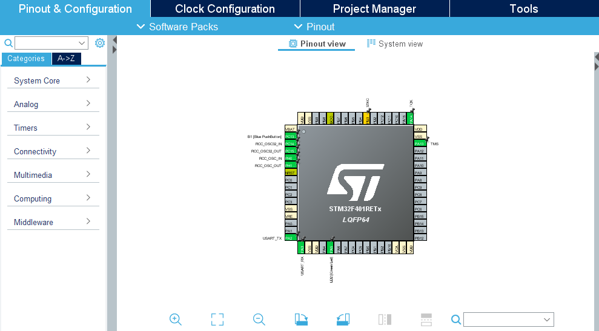
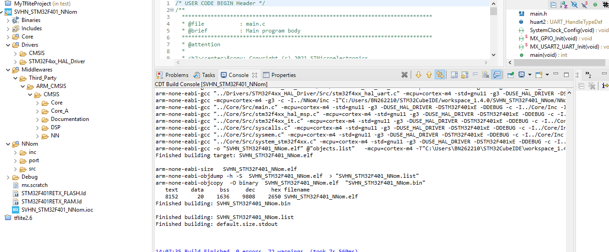

# Create our project for the board STM32F401-RE in STM32IDE environnement.

This guide was realized with : STM32cubeIDE 1.10.0, STM32CubeMX 6.6.0, CMSIS-NN 3.0.0 (CMSIS 5.8.0), NNom 0.4.3

## Prerequisite

* Download cmsis pack on : https://github.com/ARM-software/CMSIS_5/releases/download/5.8.0/ARM.CMSIS.5.8.0.pack

## Creation of project with STM32CubeMX

1) On STM32CubeMX, select the board NUCLEO-F401RETx and choose initialize all peripherals with their default mode.

  

### 2) Add CMSIS-NN middleware

In the pinout & configuration windows:
* Click on software pack->Manage Software pack (or use Alt-U) ->From Local...
* Select the downloaded ARM.CMSIS.5.8.0.pack in your file system
* On the left part of the windows, click on software pack-> ARM CMSIS 5.8.0 then check CMSIS CORE/CMSIS DSP/CMSIS NN

### 3) Frequency and timer for sleep

In the Clock Configuration windows :
* Modify the various parameters such as the HCLOCK and APB2 timer clock are at 84 MHz

In the Pinout & Configurations windows->Timers : 
* Activate TIM10
* Set Prescaler to 8400-1 in parameter settings
* Set Counter Period to 2000-1 in parameter settings (for sleeping time of 200 ms)

### 4) Generate project
In the "Project Manager" windows:
* Choose a name for your project
* Select STM32CubeIde as your IDE
* Click on "Generate Code" button

### 5) Add NNom micro C/C++ library (STM32CubeIDE)

In the "Project Explorer" windows of STM32CubeIDE:
* Create a NNom folder as "source folder" in your project
* Copy the src/port/inc folders (located in Scripts/nnom_micro on the git) in the NNom folder

    

### 6) Path and symbol

In the properties windows (ALT+enter) :

* In C/C++ General-> Paths and Symbols-> Includes, add the following paths:
    * NNom/inc
    * NNom/inc/layers
    * NNom/port

* In C/C++ General-> Paths and Symbols-> Symbols, add the following symbols:
    * ARM_MATH_CM4 (the last number depend of the generations of microcontrollers)
    * _DSP_PRESENT = 1 (for cortex M4 and M7)

### 7) Import you model/layers and input

* Generate the file weights.h and test_data.h with the file test.py in Scripts/auto_test.
* Copy them in the folder Core/Inc of your project.
* Modify the file main.c to realize inferences.

## Experiments

* For groups, kernel size, input width, input channels and filters:
    * Generate others weights.h and test_data.h files
    * Copy them in the folder Core/Inc of your project

* For frequency, redo step 3 with the wanted frequency
* For optimization level:
    * Go to Properties -> C/C++ Build -> Settings -> Tool settings -> MCU GCC Compiler -> Optimization
    * Select the wanted Optimization level

## Possible errors
* You may need to delete all the folder in Middlewares/Third_Party/ARM_CMSIS/CMSIS/DSP/Source

  
